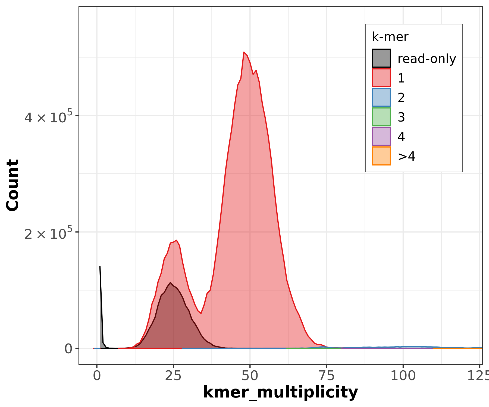
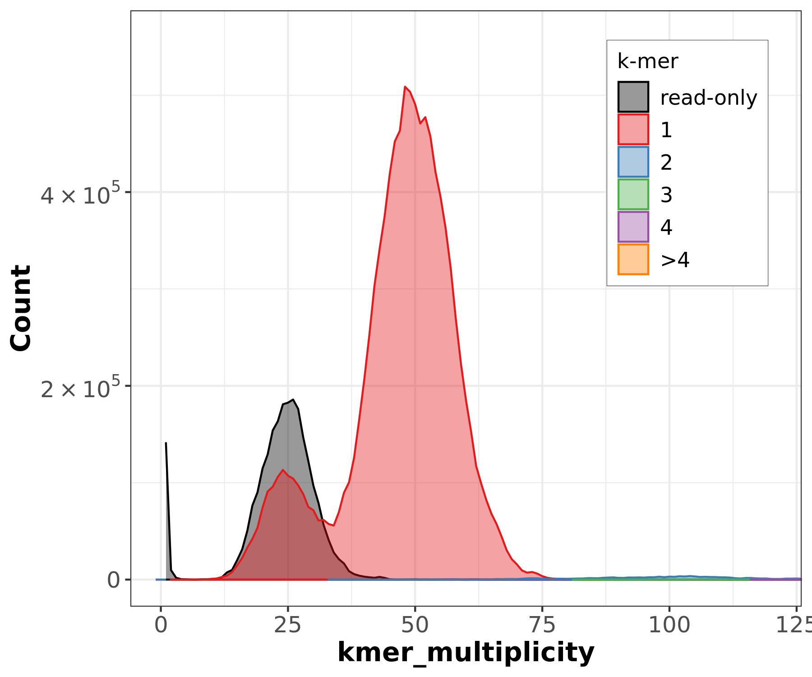

# 🧬 VGP Genome Assembly on Galaxy
**Course Assignment** | *Vertebrate Genome Project (VGP) Pipeline using UseGalaxy.org*

Based on the [Galaxy Training Network](https://training.galaxyproject.org/) tutorial.

---

## 🧭 Project Overview
This repository documents my hands-on implementation of the **Vertebrate Genomes Project (VGP)** genome assembly pipeline on UseGalaxy. The goal of the VGP is to generate high-quality, chromosome-level, haplotype-phased genome assemblies for vertebrate species.

### 📊 Data Sources
I used two types of sequencing data:
* **PacBio HiFi reads:** Long, highly accurate reads (~10–20 kbp, >Q20 accuracy) for contig assembly.
* **Hi-C reads:** Chromatin interaction data used to determine physical proximity, enabling chromosome-scale scaffolding.

---

## 🗺️ Pipeline Overview
The pipeline moves from raw reads to a chromosome-scale assembly through four main stages:

1.  **Genome Profiling** → Estimate size, heterozygosity, and repeat content.
2.  **Contig Assembly** → Assemble HiFi reads into phased haplotype contigs.
3.  **Post-Assembly QC** → Remove duplicates and assess completeness.
4.  **Hi-C Scaffolding** → Order and orient contigs into final chromosome-scale scaffolds.

---

## 🔬 Step-by-Step Walkthrough

### Step 1: Data Upload
I uploaded the following to Galaxy:
* HiFi reads (`.fastq.gz`) — PacBio CCS long reads.
* Hi-C reads (`.bam`) — Forward and reverse chromatin interaction reads.

### Step 2: Genome Profiling (K-mer Analysis)
**Tools:** `Meryl` + `GenomeScope2`  
K-mers are short, fixed-length substrings of DNA (I used $k=31$). By counting k-mer occurrences, I characterized the genome before assembly.

The plot shows two peaks: the smaller one at ~25x coverage represents **heterozygous k-mers**, and the larger one at ~50x represents **homozygous k-mers**.

| Parameter | Value |
| :--- | :--- |
| **Estimated genome size** | ~11.7 Mbp |
| **Heterozygosity** | 0.58% |
| **Duplication** | 4.98% |
| **Error rate** | 0.000943% |

---

### Step 3: Contig Assembly with `hifiasm`
**Tool:** `hifiasm` (Hi-C phasing mode)  
I ran `hifiasm` to build an overlap graph and resolve haplotype bubbles using Hi-C data. This produced two phased assemblies: **Hap1** and **Hap2** (`.gfa` format), which I converted to FASTA using `gfastats`.

---

### Step 4: Purging Duplicate Sequences
**Tool:** `purge_dups`  
To prevent artificial inflation of the assembly size, I used `purge_dups` to map HiFi reads back to the assembly, identify duplicated "haplotigs," and remove them from the primary assembly.

---

### Step 5: Assembly Quality Control
**Tools:** `BUSCO`, `Merqury`

#### BUSCO — Completeness via conserved genes
I checked for 2,137 genes expected to be present as single copies across the Saccharomycetes lineage.

| Metric | Hap1 | Hap2 |
| :--- | :--- | :--- |
| **Complete** | 94.1% (2012) | 88.7% (1895) |
| **Single-copy** | 92.3% (1973) | 87.2% (1864) |
| **Duplicated** | 1.8% (39) | 1.5% (31) |
| **Missing** | 3.2% (67) | 8.4% (181) |
| **Scaffold N50** | 923 KB | 922 KB |

  
  

#### Merqury — K-mer based assessment
I used Merqury to evaluate how well the assembly captures the k-mers from the raw reads.

  
  

The dominant red peak aligned with the read k-mers indicates high assembly completeness.

---

### Step 6: Hi-C Scaffolding
**Tools:** `BWA-MEM`, `Samtools`, `PretextMap`, `YAHS`  
I used Hi-C sequencing to capture physical proximity in the nucleus, allowing me to order and orient contigs into chromosomes.

1.  Mapped Hi-C reads to the purged assembly using `BWA-MEM`.
2.  Filtered and sorted alignments with `Samtools`.
3.  Generated a contact map using `PretextMap`.
4.  Scaffolded contigs into final sequences using `YAHS`.

---

## 📊 Results Summary

| Metric | Hap1 | Hap2 |
| :--- | :--- | :--- |
| **Total length** | ~12.2 Mbp | ~11.3 Mbp |
| **Number of scaffolds** | 17 | 16 |
| **Scaffold N50** | 923 KB | 922 KB |
| **BUSCO complete** | 94.1% | 88.7% |
| **Percent gaps** | 0% | 0% |

---

## 🔑 Key Concepts

| Term | Plain English |
| :--- | :--- |
| **Contig** | A continuous piece of assembled DNA with no gaps. |
| **Scaffold** | Contigs joined in chromosome order with gaps (Ns) between them. |
| **Haplotype** | One of the two copies of each chromosome (maternal/paternal). |
| **K-mer** | A DNA substring of length k used to count frequencies. |
| **N50** | A statistic where half the assembly is in pieces of this length or longer. |
| **Hi-C** | A technique used to capture 3D genome organization. |
| **PretextMap** | A genome contact map visualizing Hi-C interaction frequency. |
| **YAHS** | Yet Another Hi-C Scaffolder — joins contigs into chromosome-scale sequences. |
| **Haplotig** | A contig representing one haplotype of a heterozygous region. |

---
## 📁 Repository Structure

The following directory structure reflects the organization of the project and the location of the analysis outputs used in this documentation:

vgp-galaxy-assembly/
├── README.md
└── screenshots/
    ├── genomescope_profile.png
    ├── busco_hap1.png
    ├── busco_hap2.png
    ├── merqury_hap1_spectra.png
    └── merqury_hap2_spectra.png

> **Note:** This project was completed as part of a course assignment using the [UseGalaxy.org](https://usegalaxy.org) platform.
